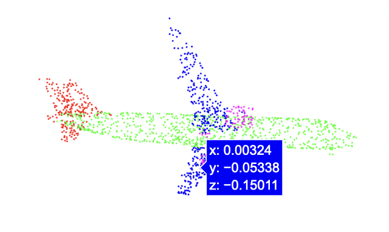
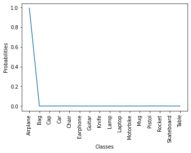
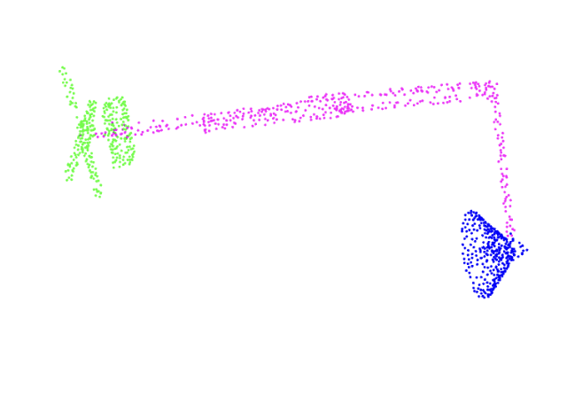
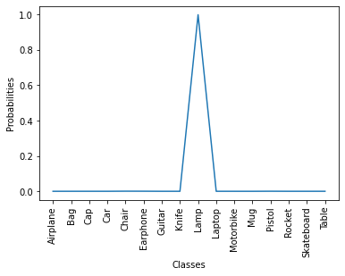

# 3D-Deep-Learning
 

This is a PyTorch implementation of ["PointNet: Deep Learning on Point Sets for 3D Classification and Segmentation"](https://arxiv.org/abs/1612.00593) used to detect objects from a point cloud.

<div align="center">
<table>
    <thead>
        <tr>
            <th align="left">Point cloud</th>
            <th align="center">Output of PointNet classification</th>
        </tr>
    </thead>
    <tbody>
        <tr>
            <td align="left"></td>
            <td align="center"></td>
        </tr>
    </tbody>
    <tbody>
        <tr>
            <td align="left"></td>
            <td align="center"></td>
        </tr>
    </tbody>
</table>
</div> 

Structure of `PointNet.ipynb`:
1. Process a 3D point cloud dataset
2. Visualise the datase in 3D
3. Build a 3D deep learning model
4. Test on new data

The code has been adapted from Intel's version: https://github.com/intel-isl/Open3D-PointNet

## Download the dataset
Download the ShapeNet dataset using this [link](https://shapenet.cs.stanford.edu/ericyi/shapenetcore_partanno_segmentation_benchmark_v0.zip) or running this code:
```bash
wget -nv https://shapenet.cs.stanford.edu/ericyi/shapenetcore_partanno_segmentation_benchmark_v0.zip --no-check-certificate
unzip shapenetcore_partanno_segmentation_benchmark_v0.zip
rm shapenetcore_partanno_segmentation_benchmark_v0.zip
```
Details about the dataset: It is a segmentation subset of the ShapeNetCore models. It contains 16 000 point clouds with 16 shape categories.

